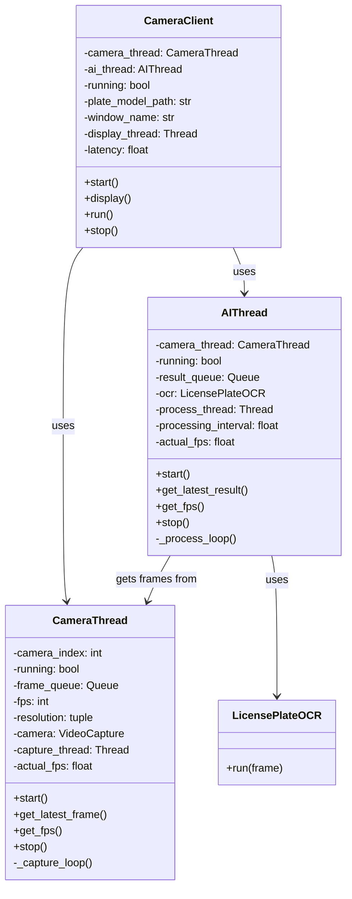
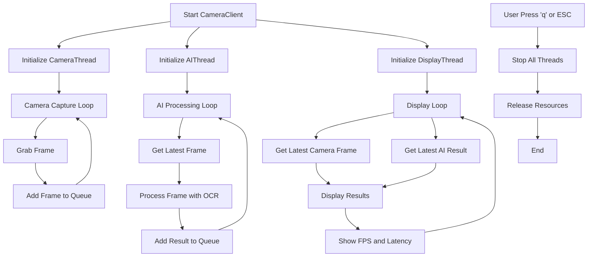

# Camera System with License Plate Detection

A multi-threaded camera system with real-time license plate detection and OCR processing.

## System Architecture



## System Flow



## Features

- **Multi-threaded Architecture**: Separate threads for camera capture, AI processing, and display
- **Real-time Processing**: Optimized for minimal latency
- **License Plate Detection**: Uses YOLO8 ONNX model for license plate detection
- **Performance Monitoring**: Real-time FPS and latency metrics
- **Resource Management**: Queue-based frame management to prevent memory overflow

## Components

### 1. CameraThread

Responsible for capturing frames from the camera:
- Configurable FPS and resolution
- Frame queueing system
- Real-time FPS calculation
- Thread-safe frame access

### 2. AIThread

Handles AI processing of camera frames:
- License plate detection and OCR
- Configurable processing intervals
- Performance monitoring
- Thread-safe result access

### 3. CameraClient

Main controller that orchestrates the system:
- Initializes camera and AI components
- Manages display of results
- Monitors system performance
- Handles user input and system shutdown

## Installation

```bash
# Clone the repository
git clone https://github.com/your-username/camera-license-plate-system.git
cd camera-license-plate-system

# Install dependencies
pip install opencv-python threading
```

## Usage

```bash
python main.py
```

## Configuration

The main parameters can be configured in the `__main__` section:

```python
client = CameraClient(
    camera_index=0,  # Camera device index
    plate_model_path="./plate_detection_yolo8.onnx",  # Path to ONNX model
    resolution=(640, 480)  # Camera resolution
)
```

## Performance Optimization Tips

1. **Adjust Processing Interval**: Set `processing_interval` in `AIThread` to balance CPU usage and responsiveness
2. **Camera Resolution**: Lower resolution improves processing speed but may reduce detection accuracy
3. **Queue Size**: Adjust queue sizes based on available memory and processing capabilities

## System Requirements

- Python 3.7+
- OpenCV 4.5+
- ONNX Runtime
- Camera device (webcam or IP camera)
